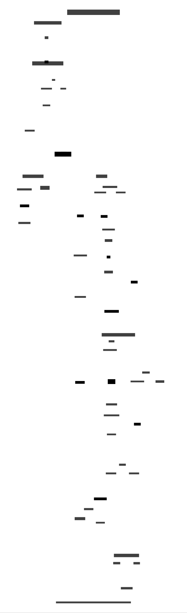

# Social Fan-Out Pipeline

A serverless event-driven architecture that distributes content from a single source to multiple social platforms simultaneously. One push, everywhere.

## Architecture



## Overview

This repository implements the **fan-out pattern**—a classic cloud architecture concept—for social media publishing:

```
[Markdown] → [git push] → [GitHub Actions] → [Pub/Sub] → [Workflows] → [LinkedIn + Threads]
                              ↓
                    Workload Identity Federation
                       (keyless auth)
```

## Why This Architecture?

**The Problem:** Publishing the same content to multiple platforms means copy-pasting, reformatting, and manually hitting publish three times. It kills the flow.

**The Solution:** Write once in Markdown, push to git, and let the infrastructure handle distribution with platform-specific formatting.

## Key Features

### Keyless Authentication (Workload Identity Federation)

No service account JSON keys stored anywhere. GitHub Actions exchanges a short-lived OIDC token for Google Cloud credentials. This aligns with Zero Trust principles—verify explicitly, assume nothing.

### Parallel Execution with Independent Retry

Using Google Cloud Workflows, each platform runs as an independent branch:

- If LinkedIn's API throws a 500, only the LinkedIn branch retries
- Threads continues publishing on schedule
- The whole pipeline doesn't crash because one API had a bad day

### Exponential Backoff

| Platform | Max Retries | Initial Delay | Max Delay |
|----------|-------------|---------------|-----------|
| LinkedIn | 3 | 2s | 60s |
| Threads | 5 | 3s | 120s |

Retries only on HTTP 429 (rate limit) or 5xx (server errors).

### Runtime Secret Retrieval

API tokens live in Google Secret Manager, fetched at runtime. Even if someone intercepts the Pub/Sub message, they only see your blog post text—not your credentials.

## Architecture Components

| Component | Purpose |
|-----------|---------|
| **GitHub Actions** | Trigger on push, authenticate via WIF, publish to Pub/Sub |
| **Pub/Sub** | Message ingestion and decoupling |
| **Eventarc** | Routes Pub/Sub messages to Workflows |
| **Cloud Workflows** | Orchestrates parallel publishing with retry logic |
| **Cloud Functions** | Platform-specific API integrations |
| **Secret Manager** | Secure credential storage |

## What's Inside

```
├── docs/
│   ├── ARCHITECTURE.md      # Detailed system design
│   └── architecture-diagram.svg
├── workflow/
│   └── workflow.yaml        # Cloud Workflows definition
├── functions/
│   ├── publish-linkedin/    # LinkedIn API integration
│   └── publish-threads/     # Threads/Meta Graph API integration
├── examples/
│   └── github-action.yml    # Sample GitHub Actions workflow
└── deploy.sh                # Deployment script (gcloud CLI)
```

## Prerequisites

- Google Cloud project with billing enabled
- GitHub repository for your content
- LinkedIn Developer App (for API access)
- Meta Developer App (for Threads API access)

## Quick Start

1. **Set up Workload Identity Federation**
   ```bash
   # Create workload identity pool
   gcloud iam workload-identity-pools create "github-pool" \
     --location="global" \
     --display-name="GitHub Actions Pool"
   ```

2. **Deploy infrastructure**
   ```bash
   ./deploy.sh
   ```

3. **Configure GitHub Secrets**
   - `GCP_PROJECT_ID`
   - `GCP_WORKLOAD_IDENTITY_PROVIDER`
   - `GCP_SERVICE_ACCOUNT`

4. **Push content and watch it fan out**

## Cost

Runs within Google Cloud free tier for personal use (~30 posts/month):
- Cloud Functions: 2M invocations/month free
- Pub/Sub: 10GB/month free
- Workflows: 5,000 steps/month free
- Secret Manager: 6 active secrets free

## The Fan-Out Pattern

This implementation applies the [fan-out/fan-in pattern](https://docs.aws.amazon.com/lambda/latest/operatorguide/fanout-pattern.html) from distributed systems architecture. A single event triggers multiple independent downstream processes, each handling their own retries and failures without blocking the others.

The pattern is commonly used for:
- Notification systems
- Data replication
- Event broadcasting
- Parallel processing pipelines

## Engineering Decisions

**Why Workflows over direct Pub/Sub triggers?** Granular retry control. With Pub/Sub triggers, a failure retries the entire function. With Workflows, you can retry specific branches with custom backoff policies.

**Why Eventarc in the middle?** Observability. Eventarc provides a managed layer with built-in logging, metrics, and dead-letter handling independent of the consumer.

**Why Secret Manager over environment variables?** Audit logging and access control. You can see who accessed which secret and when, plus rotate credentials without redeploying.

## License

Apache-2.0

## Acknowledgments

- [Google Cloud Workflows](https://cloud.google.com/workflows) — Serverless orchestration
- [Workload Identity Federation](https://cloud.google.com/iam/docs/workload-identity-federation) — Keyless authentication
- The fan-out pattern — A time-tested distributed systems concept
